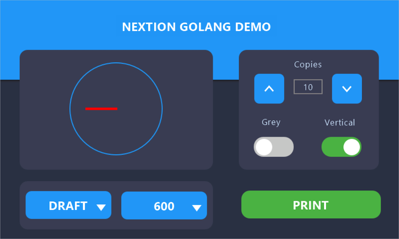

# nextion
Go library for HMI Nextion displays

See cmd/main.go example project and etc/nextion.HMI source

## Usage

Import nextion package

	import "github.com/tsybulin/nextion"

Create nextion instance

	nxt := nextion.NewNextion("/dev/tty.usbmodem401") // Serial device

Init nextion 

	err := nxt.Init(9600) // Baud rate
	if err != nil {
		log.Fatal(err)
	}

	defer nxt.Close()

Create first page

	page := nxt.NewPage(0, "p0") // use page id and name from HMI project

Add a button to page

	button := nxt.NewButton(1, "b0") // use button object id and name from HMI project

Handle button press

Make sure "Send object id" is checked for this button in the HMI project

	func btnDidPush(o nextion.Object) {
		log.Print("button did press: ", o.ObjectId())
	}

	button.AttachPush("main", btnDidPush) // unique handler name for this button

BTW: You can attach Push and Pop event handlers to any Touchable interface, like Page, Button, Text, Number, ...

Add text field

	txt = page.NewText(2, "t0")
	txt.SetText("New text")

Add number field

	num = page.NewNumber(3, "n0")
	err, v := num.Value()
	if err == nil {
		num.SetValue(v+1)
	}

